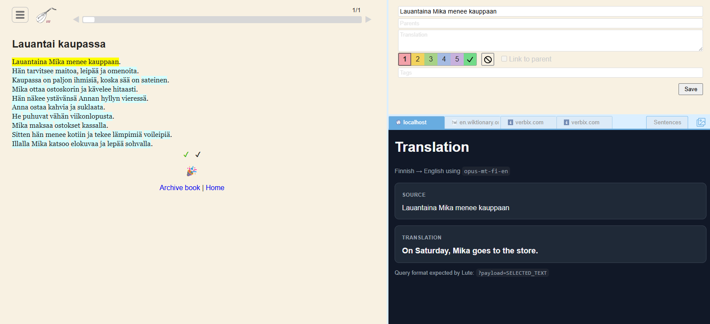
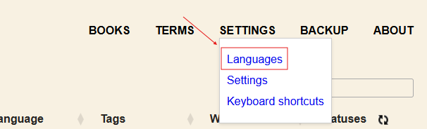
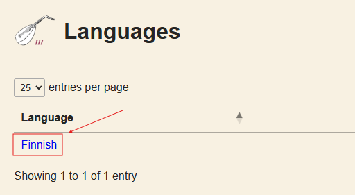
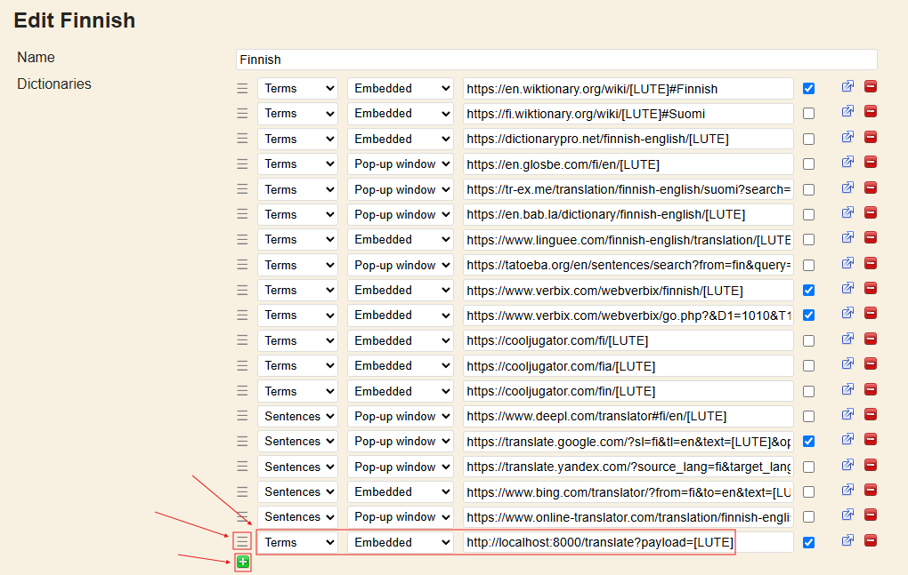

# Lute AI Translation Panel



This project lets you launch Lute (Learning Using Texts) with an intuitive translation panel powered by local AI models.

Below you can find:
1. How to launch the app
2. How to configure the panel in Lute
3. Motivation
4. Credits

## 1. How to launch the app

### 1.1 Configure environment variables

Create `.env` from `.env.example` and set the model you want by updating the values of `MT_MODEL`, `SOURCE_LANGUAGE_DEFAULT` and `TARGET_LANGUAGE_DEFAULT`:

```env
PORT=8000
HOST=0.0.0.0
MT_MODEL=Helsinki-NLP/opus-mt-fi-en
MODEL_CACHE_DIR=/model_cache
SOURCE_LANGUAGE_DEFAULT=Finnish
TARGET_LANGUAGE_DEFAULT=English
MAX_INPUT_CHARS=1000
LOG_LEVEL=INFO
```

Example model values:

| Translation | MT_MODEL | SOURCE_LANGUAGE_DEFAULT | TARGET_LANGUAGE_DEFAULT |
| --- | --- | --- | --- |
| Finnish to English | `Helsinki-NLP/opus-mt-fi-en` | `Finnish` | `English` |
| English to Finnish | `Helsinki-NLP/opus-mt-en-fi` | `English` | `Finnish` |
| Spanish to English | `Helsinki-NLP/opus-mt-es-en` | `Spanish` | `English` |
| English to Spanish | `Helsinki-NLP/opus-mt-en-es` | `English` | `Spanish` |
| French to English | `Helsinki-NLP/opus-mt-fr-en` | `French` | `English` |
| English to French | `Helsinki-NLP/opus-mt-en-fr` | `English` | `French` |
| Italian to English | `Helsinki-NLP/opus-mt-it-en` | `Italian` | `English` |
| English to Italian | `Helsinki-NLP/opus-mt-en-it` | `English` | `Italian` |

### 1.2 Launch Docker containers

Launch Docker containers with Docker Compose:

```sh
$ docker compose up -d --build
```

Note: The model is prefetched during the Docker image build. For this reason, to switch models, update `.env`, rebuild and recreate the service:

```sh
$ docker compose up -d --build --force-recreate
```

Lute will be available at `localhost:5001` and the translation panel at `localhost:{PORT}` (e.g. `localhost:8000`).

Try visiting `localhost:8000/translate?payload=Tervetuloa. Tämä on Lute AI panel` and changing the value of `payload` for a quick demo.

## 2. How to configure the panel in Lute

- Open language settings from the header menu



- Select your language



- Add a dictionary entry by clicking the `+` icon and set the following values: `Terms`, `Embedded` and `http://localhost:8000/translate?payload=[LUTE]` (replace 8000 with your port if you changed it)
- Move the entry to the desired position by dragging the icon on the left side of the entry
- Save



## 3. Motivation

I like studying languages and I am currently learning Finnish. In addition to traditional learning methods, I discovered the Lute project and immediately liked the idea behind it.

I wanted to try integrating an AI translation panel into Lute for a few reasons: 
- AI translations can sometimes be more accurate than regular online translators
- I wanted to experiment with local AI models that can run on a CPU
- I was curious to see what could be built
- I hope to inspire other developers to contribute to Lute and create useful plugins

## 4. Credits

- Lute for the amazing project: https://github.com/LuteOrg/lute-v3
- Helsinki-NLP and the OPUS-MT project for the amazing models: https://github.com/Helsinki-NLP/Opus-MT
- OPUS-MT reference papers:
```bibtex
@article{tiedemann2023democratizing,
  title={Democratizing neural machine translation with {OPUS-MT}},
  author={Tiedemann, J{\"o}rg and Aulamo, Mikko and Bakshandaeva, Daria and Boggia, Michele and Gr{\"o}nroos, Stig-Arne and Nieminen, Tommi and Raganato\
, Alessandro and Scherrer, Yves and Vazquez, Raul and Virpioja, Sami},
  journal={Language Resources and Evaluation},
  number={58},
  pages={713--755},
  year={2023},
  publisher={Springer Nature},
  issn={1574-0218},
  doi={10.1007/s10579-023-09704-w}
}

@InProceedings{TiedemannThottingal:EAMT2020,
  author = {J{\"o}rg Tiedemann and Santhosh Thottingal},
  title = {{OPUS-MT} — {B}uilding open translation services for the {W}orld},
  booktitle = {Proceedings of the 22nd Annual Conferenec of the European Association for Machine Translation (EAMT)},
  year = {2020},
  address = {Lisbon, Portugal}
 }
 ```
